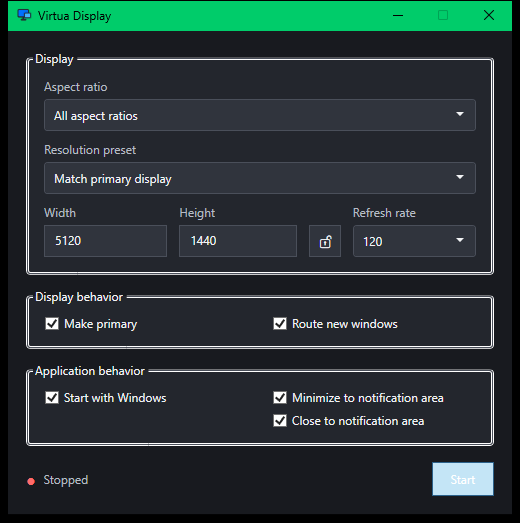

<p align=\

A small Windows GUI for creating and managing a temporary virtual display with the SudoVDA driver.

> [!IMPORTANT]
> This project is a proof of concept. It currently requires Apollo to be installed because Apollo provides the SudoVDA driver. A future version should remove this dependency.



## Features

- Create one temporary virtual display.
- Position the virtual display centered above the current primary display.
- Choose its aspect ratio, resolution, and refresh rate.
- Match the current primary display.
- Lock the aspect ratio while entering a custom resolution.
- Optionally make the virtual display primary.
- Optionally move newly opened windows onto it.
- Move windows back to the original primary display, remove the virtual display, and restore the previous layout when stopped.
- Start the app when signing in to Windows.
- Minimize the app to the Windows notification area.

## Requirements

- Windows 10 or Windows 11, x64
- Apollo with its SudoVDA driver installed
- .NET 10 Desktop Runtime

## Usage

1. Run `VirtuaDisplay.exe`.
2. Choose a resolution preset, or enter a custom width and height.
3. Select the refresh rate.
4. Enable **Make primary** or **Route new windows** if wanted.
5. Select **Start** to create the virtual display.
6. Select **Stop** when finished.

Closing the app also removes its virtual display and restores the previous display layout.

**Start with Windows** launches the app, not the virtual display. When both startup and notification-area options are enabled, the app starts hidden. Select the notification icon to reopen it, or right-click the icon to start or stop the virtual display or exit.

The Minimize button hides the app when **Minimize to notification area** is enabled. The Close button hides it when **Close to notification area** is enabled; use **Exit** from the notification-area menu to quit.

## Limitations

- This is a proof of concept, not a finished product.
- Only one virtual display is supported.
- Only windows opened after routing starts are moved.
- Elevated, protected, and system windows may not move.
- Force-closing the process can leave the virtual display active until SudoVDA cleans it up.

## Building from source

Install the .NET 10 SDK, then run:

```powershell
dotnet build src\Virtua.Display\Virtua.Display.csproj -c Release
```

The executable is written to:

```text
src\Virtua.Display\bin\Release\net10.0-windows\VirtuaDisplay.exe
```
